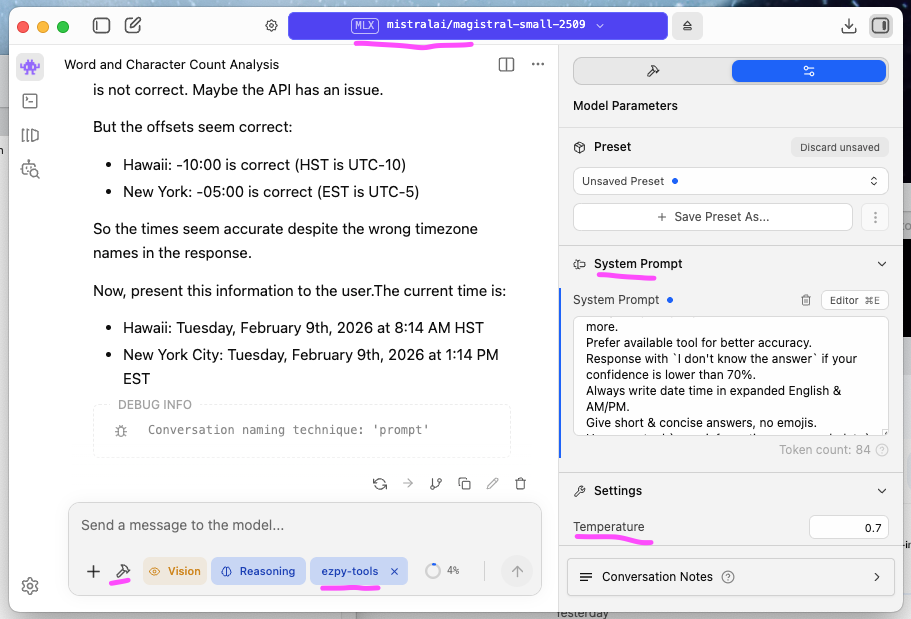

# Easy Python MCP Tools

[](https://github.com/ronin1/EzPyMcpTools/actions/workflows/pr-ci.yml)

- An easy way to create a bunch of custom tools for a Model Context Protocol (MCP) server.
- Currently, this project is used as a local MCP server for [LmStudio](https://lmstudio.ai) (or [Ollama](https://docs.ollama.com)); primarily for use with open-source models.
- It allows you to write plain Python scripts & those will show up as proper agent tools (with name space & instructions).
- This code has not been tested outside of macOS; it should work ok on Linux. I'm sorry but I don't have a machine with Windows OS to test.

## But Why?

- Although local OSS models performance is not as good as hosted commercial models of today; they are about as good as hosted commercial models of 1-2 years ago.
- 1-2 years from now, OSS models will be on-par with the best commercial models of today. So will the hardware that you can buy to run these models that sits on your desk.
- The one thing that OSS models get you that commercial models don't are: Complete Privacy & Security. It also costs you nothing but electricity to run on your own hardware.
- Commercial models have all the tooling built in. For something as simple as, asking for the current time. An OSS model can't do it without you, giving it the tools to fetch time.
- This is what this project aims to do: Make tool creation simple to empower OSS models.
- Try asking the question `What's the current time?` Before you enable these tools. The LLM can't answer. After enabling this tool, you can even ask things like: `What's the current time in Hawaii?`

## General Setup & Development

After pulling this project from GitHub:

- Ensure that you have Python 3.12+ installed
- In your console, run `make setup`, this will install all required Python packages & prompt you for your basic personal information & save it under `./user.data.json`
- Don't worry, `*.data.json` files are already in [.gitignore](./.gitignore#L65) & will never be checked in (on accident or on purpose)
- `make setup` will also call `make mcp_config` which prints the required configuration for LmStudio & Ollama.
- You can also start from `./user.data.json.example` and copy it to `./user.data.json`:

```json
{
  "name": {
    "first": "Jane",
    "middle": "Q",
    "last": "Public"
  },
  "birthday": "1990-01-31",
  "email": "jane@example.com",
  "phone": "+1-555-123-4567",
  "addresss": [
    "123 Main St, Springfield, IL 62701, US"
  ]
}
```

## Install Instructions

- If you are new to MCP Tooling or just starting AI work. I recommend LmStudio over Ollama as LmStudio is simpler & easier to get started with.
- LmStudio also allows you to select between MLX (Apple Metal optimized models) & GGUF (NVIDIA optimized) for better offloading with the hardware that you have.
- LmStudio model search also shows (& allows for filtering) based on model capabilities like tool use, thinking, vision, etc.
- The experience of setting up & running Ollama is clunky at best.

### LmStudio Setup



- Go to [lmstudio.ai](https://lmstudio.ai) & download the UI tool
- Use any model that supports tool use. Currently (Feb 7th, 2026), the author's favorite model is [Mistral 3](https://lmstudio.ai/models/ministral), [GPT-OSS 20B](https://lmstudio.ai/models/openai/gpt-oss-20b) or [GLM Flash](https://lmstudio.ai/models/zai-org/glm-4.7-flash) provided that you have enough VRAM & want the extra speed. Any model with tool use would work.
- At the time of this writing, the author uses a Mac Book Pro; equiped with an M4 Max Chip, embeded with 64Gb of Unified RAM. Performance for [Mistral-Small-2509 (MLX) 4bit](https://lmstudio.ai/models/mistralai/magistral-small-2509) was decent after it loaded. Should work with any M series Apple machine with 32G RAM or more.
- Once the model finishes downloading, load it up in a new chat & click on the 🔨 (hammer icon) to configure a custom MCP server & paste in the MCP configuration from `make setup` (or `make mcp_config`); should look like this:

```json
{
  "mcpServers": {
    "py_tools": {
      "command": "uv",
      "args": ["run", "python", "mcp_server.py"],
      "cwd": "~/{repo-dir}/tools"
    }
  }
}
```

#### Tips

- Set temperature to a low value, `0.01` for better stability.
- Change context overflow to `Rolling Window`
- Adding the following to `System Prompt` seems to help with clarity:

```txt
Prefer available tool for better accuracy. 
Response with `I don't know the answer` if your confidence is lower than 70%.
Do not use previous results or cache.
```

### Ollama Setup

By choosing **Ollama**, we assume you know what you're doing:

- Install [Ollama](https://ollama.com)
- Pull the desired Ollama model `ollama pull '{pulled_model_name}'`
- Start it in the background: `ollama serve`
- Install [McpHost](https://github.com/mark3labs/mcphost) (Golang project)
- Generate the default **McpHost** config by running `make mcp_config > .mcphost.json`
- Launch **McpHost** with the model that you pulled above `mcphost --model 'ollama:{pulled_model_name}'`
- This will launch a console-based chat app with the configured tools
- Ask the same question to test: `What's the current time?`

### Other Commercial Models & Agents

- Being a standard MCP server, it **should** be compatible with all agents & models (including commercial ones).
- Currently, this MCP server is being built for local run via `stdio` transport.  
- You can start it with `http` or `sse` transport by running: `uv run python mcp_server.py --transport http`
- *WARNING:* This MCP server has no authentication built in currently. Please do not run in `http` or `sse` protocol & expose it to the open web. You *will* get hacked.
- See Anthropic [MCP specs](https://modelcontextprotocol.io/specification/2025-06-18/basic) for more info.

### Docker (Alpine) for FastMCP `stdio`

- Build the image:

```bash
make docker-build
```

- Run Docker smoke tests across all tools:

```bash
make docker-test
```

- Run the MCP server in `stdio` mode from Docker:

```bash
docker run --rm -i \
  -v "$PWD/user.data.json:/app/user.data.json:ro" \
  ezpy-tools:alpine
```

- Example MCP config (LmStudio/Ollama host) for Docker-based `stdio`:

```json
{
  "mcpServers": {
    "ezpy_tools_docker": {
      "command": "docker",
      "args": [
        "run",
        "--rm",
        "-i",
        "-v",
        "/absolute/path/to/tools/user.data.json:/app/user.data.json:ro",
        "ezpy-tools:alpine"
      ]
    }
  }
}
```

- Run a tool directly in Docker (example: current time):

```bash
docker run --rm \
  -v "$PWD/user.data.json:/app/user.data.json:ro" \
  ezpy-tools:alpine \
  uv run python utils.py datetime__current America/Los_Angeles
```

## Writing a new Tool

This is as simple as:

- Create a new `{name_space}.py` file under `./utils/` folder
- Inside of this python script, any public function will show up as an MCP tool with `{name_space}__{function_name}`
- Functions can take any number of inputs, as long as they're basic types. They can return `None` or `dict` (any variation of `Dict[K, V]`). See `./utils/` for details.
- Don't forget to add proper description / notation to your Python class & functions as these will end up being the tools instruction - exposed via this MCP server to your AI agents.
- For the example above, I gave the model the ability to tell time via this [datetime tool](./utils/datetime.py#L131) `current()` function.
- You can test these tools directly (without running an MCP server) using `./tools` command
- You can also run the MCP server over HTTP protocol by running `make run`
- All available Python debuggers should work with `./utils.py` or `./tools` symlink

### To test individual tool

```text
./tools
# print help & all available commands (what the MCP will see too)
Run: 'ls ls <namespace>' to see functions information.
Available namespaces:

  [datetime]
    Date and time utilities.

  [ip_address]
    Public IP address & approximate location utilities.

  [math]
    Standard and scientific calculator utilities.

  [user_information]
    Current user's personal information utilities.

# see all commands under datetime namespace
./tools ls datetime
[datetime]  Date and time utilities.

  [func] datetime__configured_timezone() -> dict[str, str]
         Get the currently configured timezone.

  [func] datetime__country_timezones(country_code: str = '') -> dict[str, typing.Any]
         Get all timezones for a country using ISO 3166 country code (2 chars).

  [func] datetime__current(time_zone: str = '') -> dict[str, typing.Any]
         Get the current date and time.

# test a specific command
./tools datetime__current pdt
{
  "date_time": {
    "value": "2026-02-08 02:30:33 PM",
    "iso8601": "2026-02-08T14:30:33.478463-08:00",
    "unix_timestamp": 1770589833.478463
  },
  "timezone": {
    "name": "America/Los_Angeles",
    "code": "PST",
    "utc_offset": "-0800"
  }
}
```

`./tools` is a symlink file to `./utils.py`
